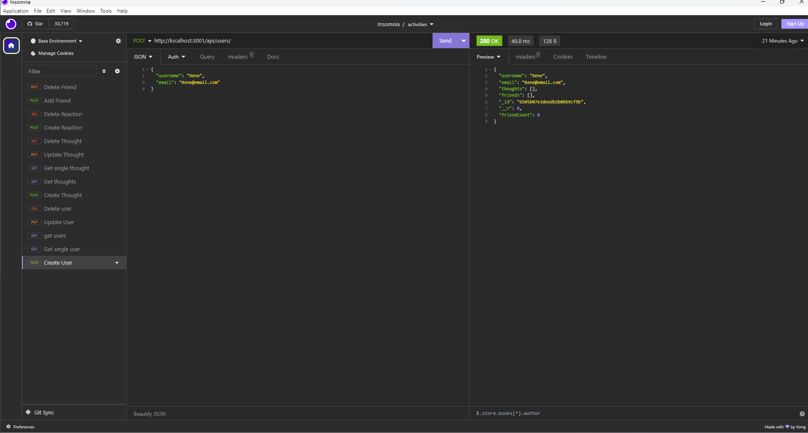
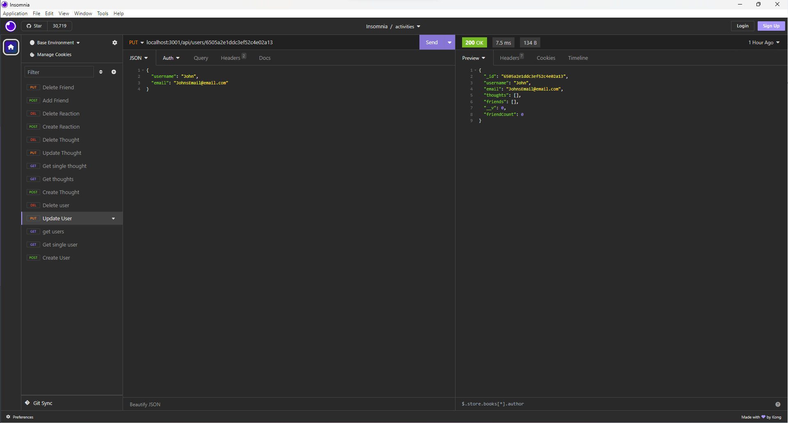
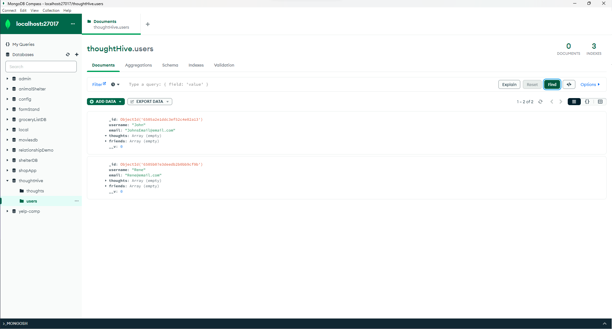

# Thought Hive - NoSQL Challenge: Social Network API

## Description

Thought Hive is a social network API project that aims to create a robust backend system for a social networking web application. The motivation behind this project is to build an efficient API capable of handling large volumes of unstructured data, mimicking the real-world requirements of modern social networking platforms. By implementing this API, we address the need to understand and work with NoSQL databases effectively.

## Table of Contents

- [Installation](#installation)

- [Usage](#usage)

- [ScreenShots](#screenshots)

- [License](#license)
- [Demonstration Video](#demonstration-video)

## Installation

### To set up Thought Hive and get the development environment running, follow these steps:

- Clone this repository to your local machine using git clone.

- Navigate to the project directory.

- Install the necessary dependencies by running the following command:
  " npm install "

- Set up your MongoDB database and configure the connection details in your project.

- Start the server using the command:
  " npm start "

You're now ready to use Thought Hive!

## Usage

Thought Hive provides a powerful API for managing social networking features. Here are some basic instructions for using it:

Access the API routes for users and thoughts using tools like Insomnia or Postman.
Retrieve data from these routes to view user profiles and thought content in well-structured JSON format.
Test API POST, PUT, and DELETE routes to create, update, and delete user profiles and thoughts.
Interact with API POST and DELETE routes to create and delete reactions to thoughts, as well as manage a user's friend list.
Feel free to explore the API and adapt it for your own social networking project!

## ScreenShots

Your GitHub Profile

## License

This project is licensed under the MIT License.

## Demonstration Video

Video: https://drive.google.com/file/d/1XRwzBstgC4Uj1YuFKXJ3CUphZ6IOhdH2/view?usp=sharing

Github Repo: https://github.com/Terence-A/ThoughtHive
